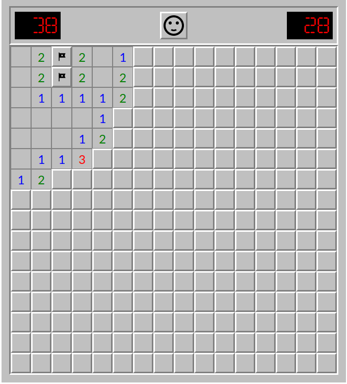

# Saper

Классическая игра Saper написанная на современном JavaScript (ES5+)

## Инструкция по запуску
Так как данная игра написана с использованием возможностей ООП языка и применением модулей, то для ее запуска и нормальной работы потребуется сервер.
В данном проекте используется пакет **browser-sync**.

1. Установить **node.js** (*рекомендуется использовать **18.14.2 LTS***)
2. Установить **gulp** глобально `npm install --global gulp-cli`
3. Установить зависимости `npm install`
4. После успешной установки зависимостей можно запустить проект командой `gulp`

---

